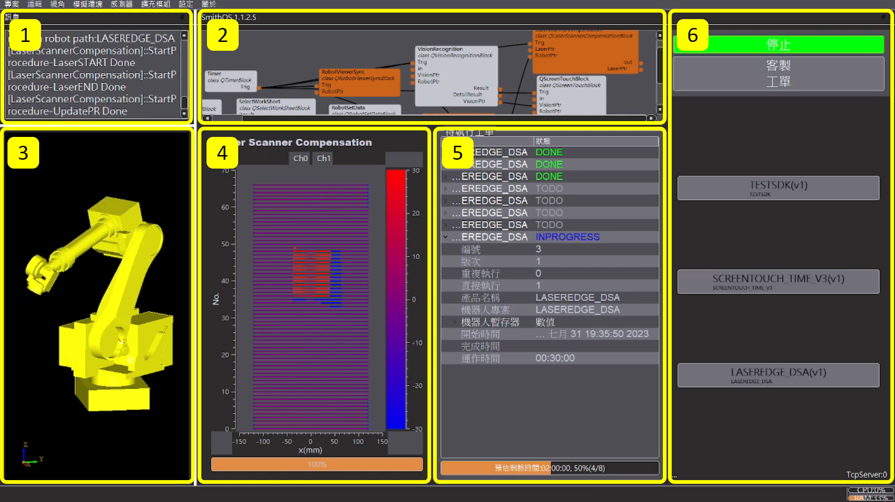

# HOLON OS 教育訓練手冊
### CH1 軟體介面介紹

1. 訊息列表
1. 製程流程圖
1. 3D環境互動介面
1. 智慧感測元件整合
1. 製程工單與運行狀態
1. 製程參數與工單列表

### CH2 權限系統

為保障資訊安全性，軟體內共有四種權限身份，您可以為不同使用者定義不同身份。
* **身份與權限**

|  等級  |   0   |   1   |   2   |  Max  |
|-------|-------|-------|-------|-------|
| 更改密碼 |   x   |   o   |   o   |   o   |
| 更改工單參數 |   x   |   o   |   o   |   o   |
| 更改工單設定 |   x   |   x   |   o   |   o   |
| 更改模塊參數 |   x   |   x   |   o   |   o   |
| 設定模塊連線 |   x   |   x   |   x   |   o   |
| 設定TCP伺服器 |   x   |   x   |   x   |   o   |

### CH3 建立製程

* **模塊功能說明**
* **模塊連線方式**

### CH4 機械手臂連線

* **連線設定**

### CH5 建立工單

* **工單設定**
* **參數設定**
* **建立排程**

### CH6 開始加工
